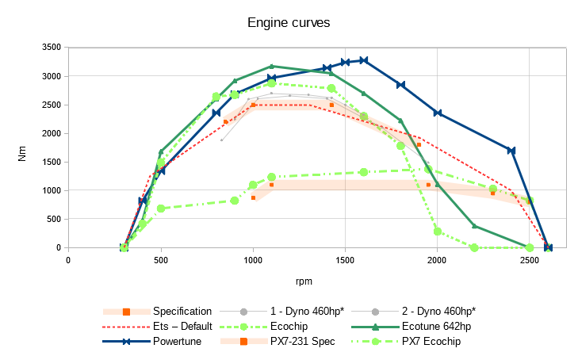

[< Go back to general mod folder](./../)

# DAF - Realistic engines

Download the latest version: [daf-realistic-engines-1.0.0-ALPHA.scs](daf-realistic-engines-1.0.0-ALPHA.scs)

## PACCAR MX-13 375 (Ecochip)

DAF XF105 — Price 19600 — 584hp (409kw) — 2875nm from 800-1425rpm

The engines ECU has been chipped to perform better on the low end, stimulating economic driving while feeling more powerful. It comes at a cost, there's not much top end power. The automatic will shift at 850 (on high gears) and rev up to 1700. But only if really necessary. This makes for a relaxed drive.

## PACCAR MX-13 375 (Ecotune)

DAF XF105 — Price 22300 — 641hp (472kw) — 3175nm from 800-1425rpm

The hardware has been tuned or improved to perform even more economic. Compared to the ecochip it produces has more power.

## PACCAR MX-13 375 (Powertune)

DAF XF105 — Price 27600 — 734hp (548kw) — 3275nm from 800-1425rpm

The hardware has been tuned or improved to perform maximal at the top end. A new variomatic turbo has been fitted. It shows with 734hp and the torque to back it up, up to nearly 2000 rpm. The engine will feel powerful with a torque curve going up until 1600 rpm. Once you press the pedal, it will keep pushing. This all comes at a cost of being less efficient at the bottom - who cares.

## EXTRA: PACCAR PX-7 231 (Ecochip)

DAF XF105 — Price 4600 — 381hp (280kw) — 1375nm from 1100-1900rpm

Yes, yes, I know this is called a 'Realistic engine mod' and this engine isn't available for the XF... I just wanted to see how it would perform. And it does. Up to 10-13 tons. Or at least ecochipped. Above that I wouldn't recommend unless you'd like to cruise pedal to the metal. Fulltime.

Anyway, this motor has a wide powerband ranging from 1100 to 1900 rpm with a limit at 2500. It idles at 600. Because of all the torque on top it produces a massive amount of horses. This motor adds a completely different driving experience. A lot of fun.

# Recommended additional mods

- [Captain Kriechbaums Open Pipe sound mod.](https://www.youtube.com/watch?v=K7oau37VCag)