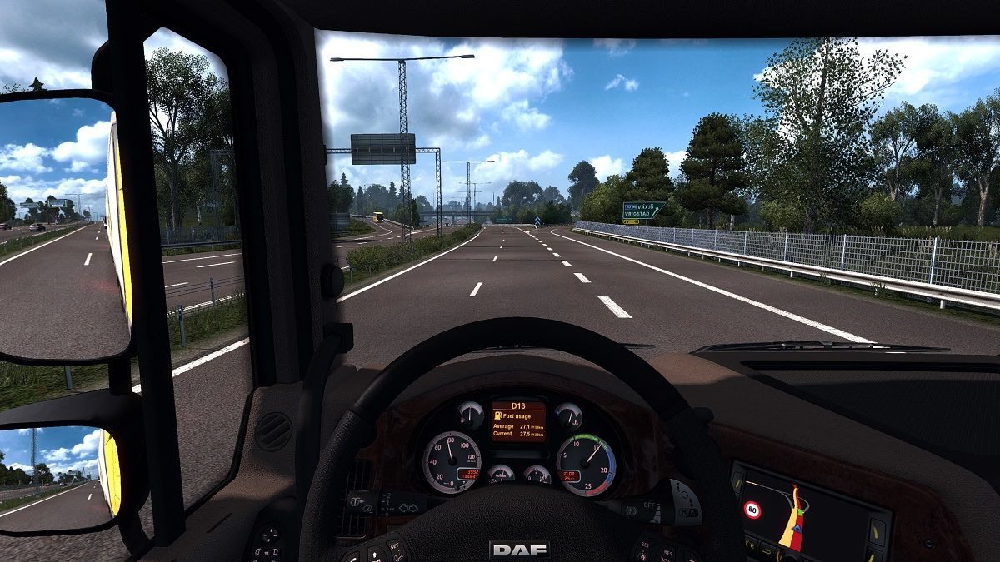

This mod adds new engines in Euro Truck Simulator 2 which are based upon their actual specifications. Some include variants with modifications. For example an ecochip or a powertune. In general you will feel the engines have a wider torque range while the automatic transmission is correctly tuned to the engine (and the pedal input). This makes for a much more realistic experience. 

- [DAF](/DAF) - XF105 (up to 734hp)
- Scania (will follow soon)

I highly recommend you to use the [Realistic Transmissions Mod](http://forum.scssoft.com/viewtopic.php?f=34&t=202890) in combination this mod.

You can adjust a mod or add new engines easily yourself as well. Go the mod folder (of the brand). Go to the `/def/vehicle/<brand>/truck/<type>/engine` folder. Add or edit the engines to your liking. The `.sii` files can be opened with Notepad. When you're finished, save and zip the contents of the mod folder. Then change the extension of the zip file to `.scs`. And there's your mod. Now copy it to the mod folder of Euro Truck Simulator and activate it in the Mod Manager and you should be good to go.

Please create a pull request if you have improvements or additions.